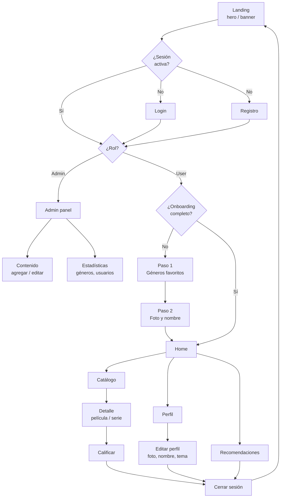

## Flujo general de navegación

```mermaid
flowchart TD
    Landing["Landing\nhero / banner"]

    Landing --> SesionActiva{"¿Sesión\nactiva?"}

    SesionActiva -->|No| Login["Login"]
    SesionActiva -->|No| Registro["Registro"]
    SesionActiva -->|Sí| Rol

    Login --> Rol{"¿Rol?"}
    Registro --> Rol

    Rol -->|Admin| AdminPanel["Admin panel"]
    Rol -->|User| Onboarding{"¿Onboarding\ncompleto?"}

    AdminPanel --> Contenido["Contenido\nagregar / editar"]
    AdminPanel --> Estadisticas["Estadísticas\ngéneros, usuarios"]

    Onboarding -->|No| Paso1["Paso 1\nGéneros favoritos"]
    Paso1 --> Paso2["Paso 2\nFoto y nombre"]
    Paso2 --> Home

    Onboarding -->|Sí| Home["Home"]

    Home --> Catalogo["Catálogo"]
    Home --> Recomendaciones["Recomendaciones"]
    Home --> Perfil["Perfil"]

    Catalogo --> Detalle["Detalle\npelícula / serie"]
    Detalle --> Calificar["Calificar"]

    Perfil --> EditarPerfil["Editar perfil\nfoto, nombre, tema"]

    Calificar --> Logout["Cerrar sesión"]
    EditarPerfil --> Logout
    Recomendaciones --> Logout

    Logout --> Landing
```
